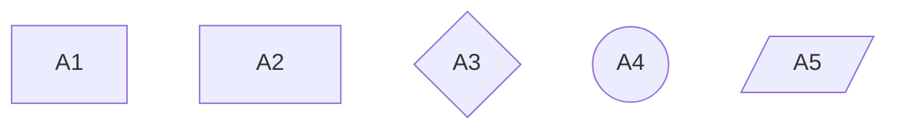

# 0000

```mermaid
graph TD
  A1["A1"]
  A2["&nbsp;&nbsp;A2&nbsp;&nbsp;"]
  A3{"A3"}
  A4(("&nbsp;&nbsp;A4&nbsp;&nbsp;"))
  A5[/"&nbsp;&nbsp;A5&nbsp;&nbsp;"/]
```

|
:-: | :-:
$A_1 = s^2$ | $(1)$
$A_2 = lw$ | $(2)$
$A_3 = \tfrac12 lh$ | $(3)$
$A_4 = \pi r^2$ | $(4)$
$A_5 = lw \sin\theta$ | $(5)$
|
