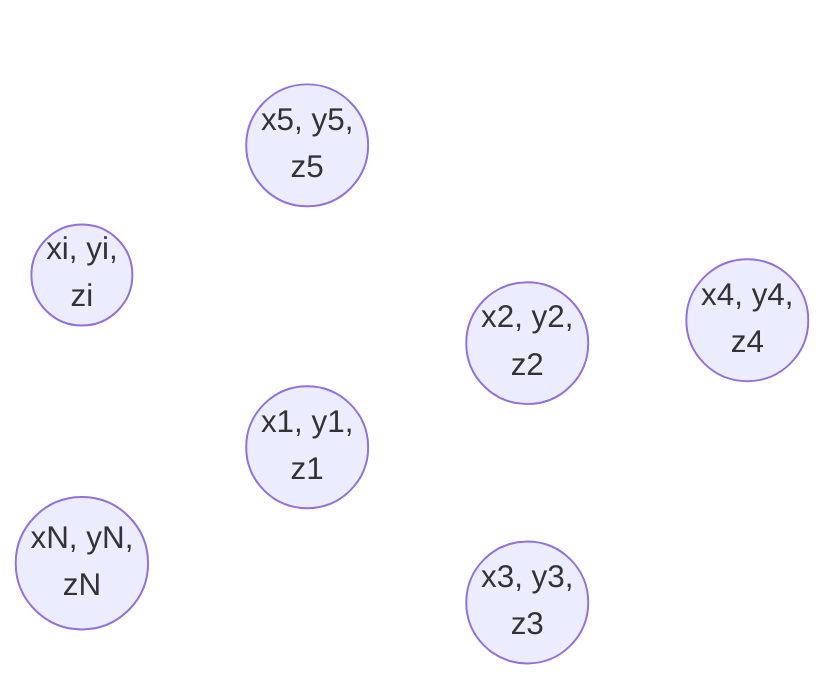

# 0002

|
:-: | :-:
$\displaystyle M = \sum_{i = 1}^N m_i$ | $(1)$
$\displaystyle x_{\rm com} = \frac1M \sum_{i = 1}^N m_i x_i$ | $(2)$
$\displaystyle y_{\rm com} = \frac1M \sum_{i = 1}^N m_i y_i$ | $(3)$
$\displaystyle z_{\rm com} = \frac1M \sum_{i = 1}^N m_i z_i$ | $(4)$
|
