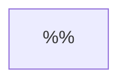

# 0005

|
:-: | :-:
$c^2 = a^2 + b^2$ | $(1)$
$a \perp b$ | $(2)$
$\theta \angle (c, a)$ | $(3)$
$\displaystyle \cos \theta = \frac{a}{c}$ | $(4)$
$\displaystyle \sin \theta = \frac{b}{c}$ | $(5)$
$\displaystyle \tan \theta = \frac{b}{a}$ | $(6)$
|
