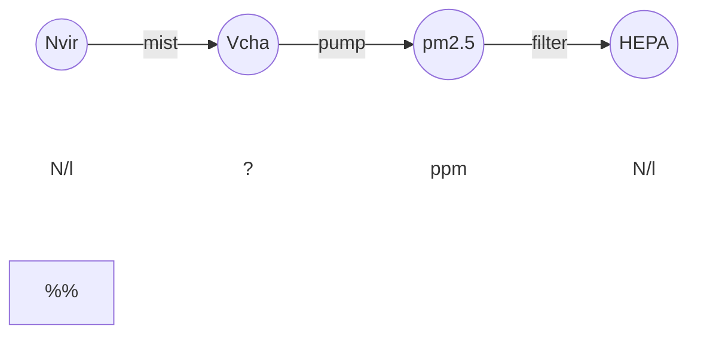

# 0015

```mermaid
graph LR
  S --mist--> C --pump--> P --filter--> M
  L1 --- L2 --- L3 --- L4
  %%
  S((Nvir))
  C((Vcha))
  P((pm2.5))
  M((HEPA))
  L1[ N/l ]
  L2[ ? ]
  L3[ ppm ]
  L4[ N/l ]
  classDef transparent fill:none,stroke:none;
  class L1,L2,L3,L4 transparent
  linkStyle 3,4,5 fill:none,stroke-width:0px,stroke:none;
```
