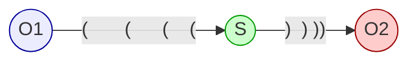

# 0016

```mermaid
graph LR
  O1 --"(&nbsp;&nbsp;&nbsp;&nbsp;&nbsp;&nbsp;&nbsp;(&nbsp;&nbsp;&nbsp;&nbsp;&nbsp;&nbsp;(&nbsp;&nbsp;&nbsp;&nbsp;("--> S
  S --")&nbsp;&nbsp;)&nbsp;))"--> O2
  O1(("O1"))
  O2(("O2"))
  S(("S"))
  %%classDef transparent fill:none,stroke:none;
  %%class L1,L2,L3,L4,V transparent
  %%linkStyle 3,4,5 fill:none,stroke-width:0px,stroke:none;
  style O1 stroke:#009,fill:ccf;
  style O2 stroke:#900,fill:#fcc;
  style S stroke:#090,fill:#cfc;
```

|
:-: | :-:
$\displaystyle f_1 = \left( \frac{v}{v + v_S} \right) f_S$ | $(1)$
$\displaystyle f_2 = \left( \frac{v}{v - v_S} \right) f_S$ | $(1)$
|
