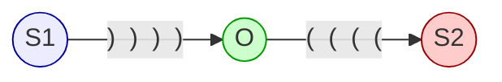

# 0017

```mermaid
graph LR
  S1 --")&nbsp;&nbsp;)&nbsp;&nbsp;)&nbsp;&nbsp;)"--> O
  O --"(&nbsp;&nbsp;(&nbsp;&nbsp;(&nbsp;&nbsp;("--> S2
  S1(("S1"))
  S2(("S2"))
  O(("O"))
  %%classDef transparent fill:none,stroke:none;
  %%class L1,L2,L3,L4,V transparent
  %%linkStyle 3,4,5 fill:none,stroke-width:0px,stroke:none;
  style S1 stroke:#009,fill:ccf;
  style S2 stroke:#900,fill:#fcc;
  style O stroke:#090,fill:#cfc;
```

|
:-: | :-:
$f_1 = f_2$ | $(0)$
$\displaystyle f_O = f_1$ | $(1)$
$\displaystyle f_O = f_2$ | $(2)$
|
